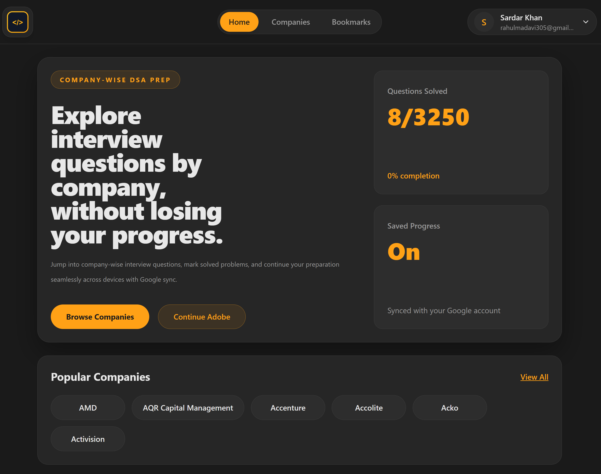
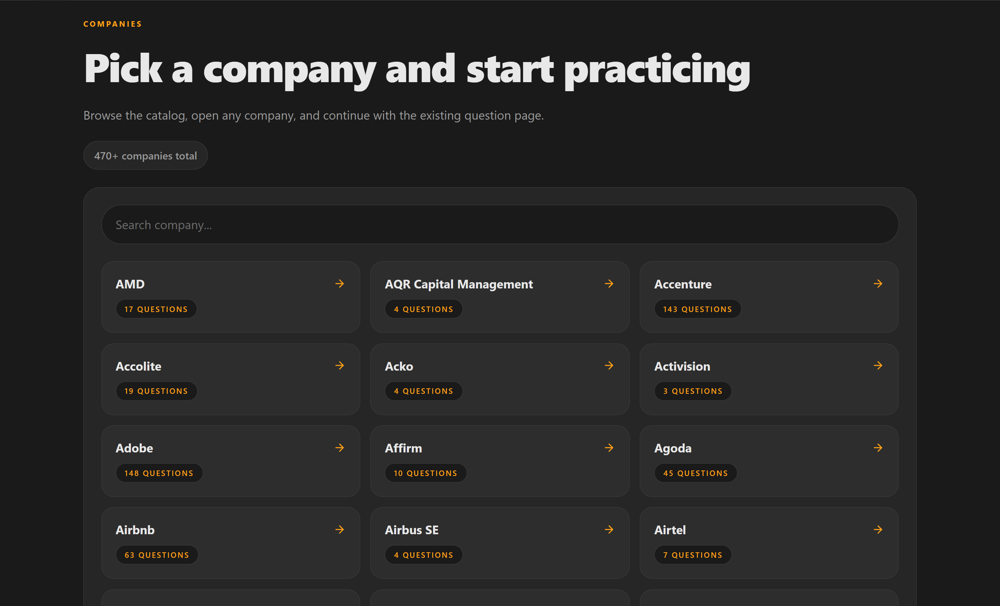
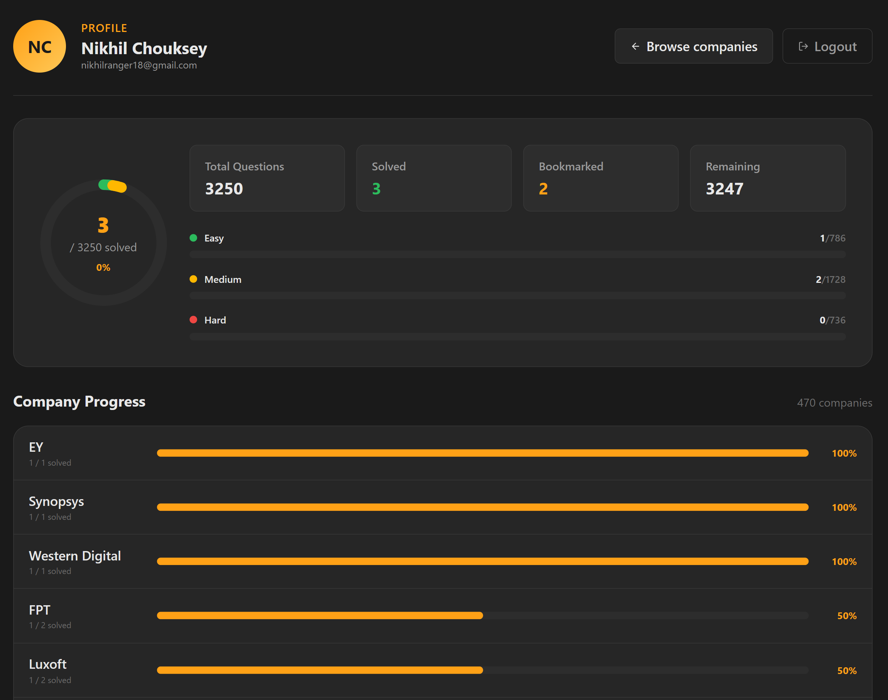

# Company-Wise DSA Platform

A full-stack web app for practicing data structures and algorithms through a company-wise interview prep experience. It helps users explore companies, review question sets, track progress, bookmark problems, and manage their profile from one place.

## Project Overview

This project is designed for learners who want a structured way to prepare for interviews. The experience is centered around a few public-facing areas:

- A homepage that introduces the platform and highlights popular companies
- A companies page for browsing and searching the company catalog
- A company detail view for reviewing question sets by difficulty and time window
- A profile page for viewing saved progress and account-related preferences
- A bookmarks area for revisiting problems later

## What Users Should See

- Company-wise DSA preparation content
- Search and filtering for companies and questions
- Question lists organized by company and recency buckets
- Bookmarking and solved-progress tracking
- A profile dashboard with high-level user activity
- Responsive layouts for desktop and mobile

## Screenshots

Add public screenshots in `docs/screenshots/` and link them below.

| Page | Screenshot |
| --- | --- |
| Homepage | `docs/screenshots/homepage.png` |
| Companies Page | `docs/screenshots/companies-page.png` |
| Profile Page | `docs/screenshots/profile-page.png` |

You can also embed them directly:

### Homepage



### Companies Page



### Profile Page



## Tech Stack

### Frontend

- React
- Vite
- React Router
- Tailwind CSS
- PostHog JavaScript SDK
- Lucide React icons

### Backend

- Node.js
- Express
- MongoDB
- Mongoose

### Supporting Libraries

- Google authentication support
- CSV parsing for the public question catalog
- Authentication and authorization utilities
- Analytics and event tracking

## Local Setup

### Frontend

```bash
cd client
npm install
npm run dev
```

### Backend

```bash
cd server
npm install
npm run dev
```

## Environment Variables

Create local environment files before running the app. Do not commit secrets or private credentials.


## Build

```bash
cd client
npm run build
```
Give a star to repo , Thank you 